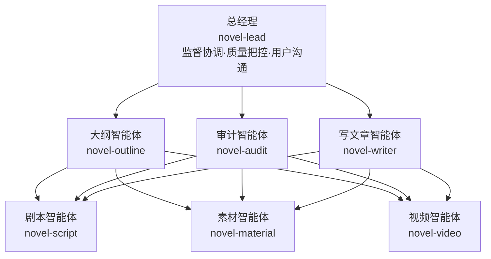

# 小说创作技能系统

基于OpenCode的小说创作助手，包含7个专业智能体和1个总经理，支持流水线模式。从想法到成品（小说+封面+短剧）全自动完成。

## 智能体架构



## 智能体职责

| 智能体 | 职责 |
|--------|------|
| **novel-lead** | 总负责人，协调所有智能体，管理流水线模式 |
| **novel-outline** | 生成大纲、名称、简介、世界观、角色设定、封面 |
| **novel-audit** | 审计章节质量，检查合规性、连贯性、一致性 |
| **novel-writer** | 根据大纲续写章节，生成章节内容和摘要 |
| **novel-script** | 设计分镜剧本，生成视频生成提示词 |
| **novel-material** | 生成人物、场景、物品图片，管理素材库 |
| **novel-video** | 生成视频片段，合成完整视频，添加转场效果 |

## 核心功能

### 1. 强制调用规则
- 总经理必须调用其他智能体，不能自己干活
- 每次处理任务时必须先问自己3个问题

### 2. 文件名锁定规则
- 审计文件必须命名为：`[第XX章]_审计.md`
- 禁止合并多个章节审计
- 禁止擅自更改文件名

### 3. 审计规则
- 一个章节一个审计报告
- 禁止合并多个章节审计
- 审计文件必须保存到`审计/`目录

### 4. 搜索功能
- 实时搜索男频/女频分类信息
- 搜索热门标签
- 搜索内容偏好差异

### 5. 全局规则
- 不生成英语文字：提示词加入"No English text, no words, no letters, no subtitles"
- 不生成字幕：提示词加入"不生成字幕"
- 实时搜索最新参数：每次生成前都要搜索模型最新参数

### 6. 多小说项目管理
- 使用`novella.json`管理多个小说项目
- 支持切换当前活跃项目
- 自动创建和管理项目文件夹

## 使用方法

### 1. 安装技能
将以下文件复制到对应位置：
- `SKILL.md` → `~/.agents/skills/novel/SKILL.md`
- `novel-*.md` → `~/.opencode/agents/`
- `novella.json` → `~/.opencode/skills/novel/novella.json`

### 2. 调用技能
每次对话开始时，说：
- "使用小说创作技能"
- 或"调用novel skill"
- 或直接描述创作需求

### 3. 流水线模式
说"开启流水线模式"后，除以下关键节点外全部自动完成：
- 大纲确认
- 审计问题
- API错误
- 流程完成

## 文件结构

```
[小说名称]/
├── 大纲.md
├── 世界观.md
├── 章节/
│   ├── 第01章.md
│   ├── 第02章.md
│   └── ...
├── 审计/
│   ├── 第01章_审计.md
│   ├── 第02章_审计.md
│   └── ...
├── 素材/
│   ├── 人物/
│   ├── 场景/
│   └── 物品/
└── 视频/
```

## 注意事项

1. **必须调用技能**：每次对话开始时必须调用skill，否则AI会忘记规则
2. **单章审计**：每个章节必须单独审计，禁止合并多个章节
3. **文件名保护**：禁止擅自更改文件名，除非用户同意
4. **实时搜索**：所有搜索都必须实时获取最新数据，不要使用缓存

## 许可证

MIT License